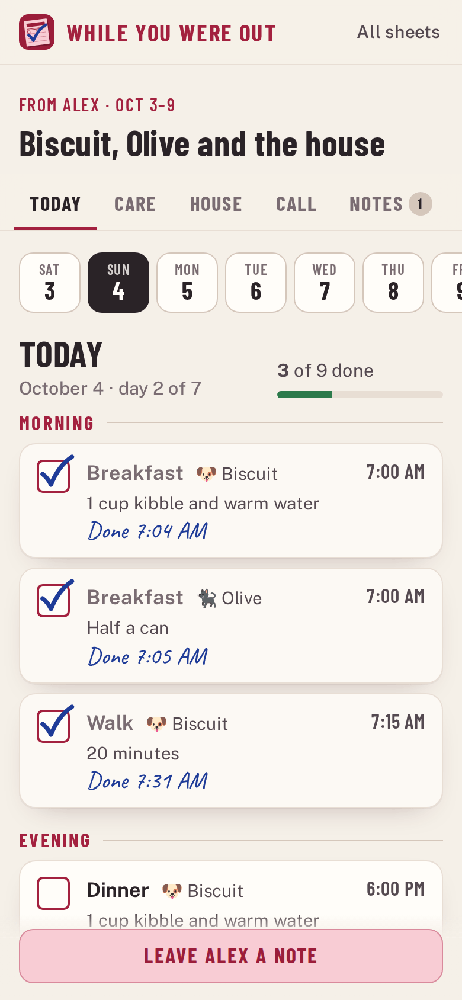
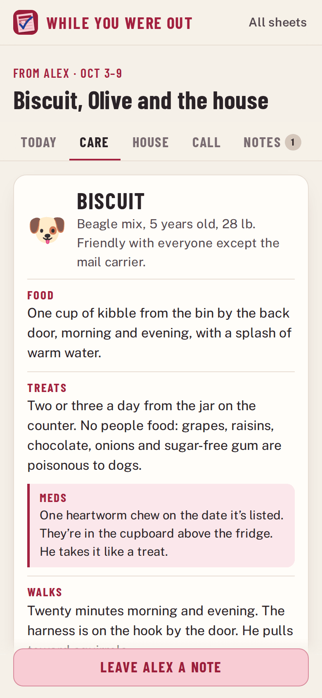
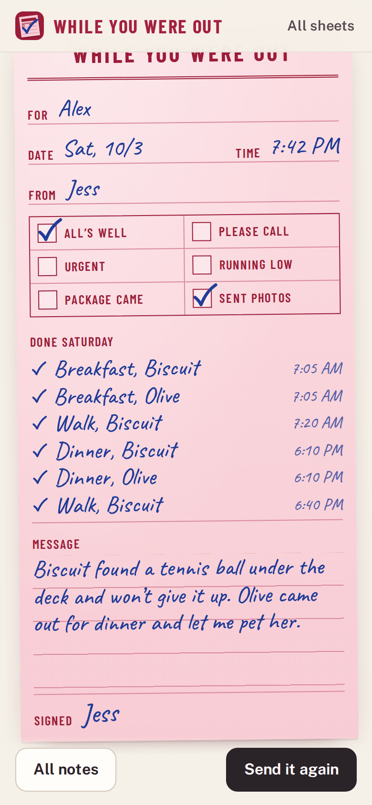
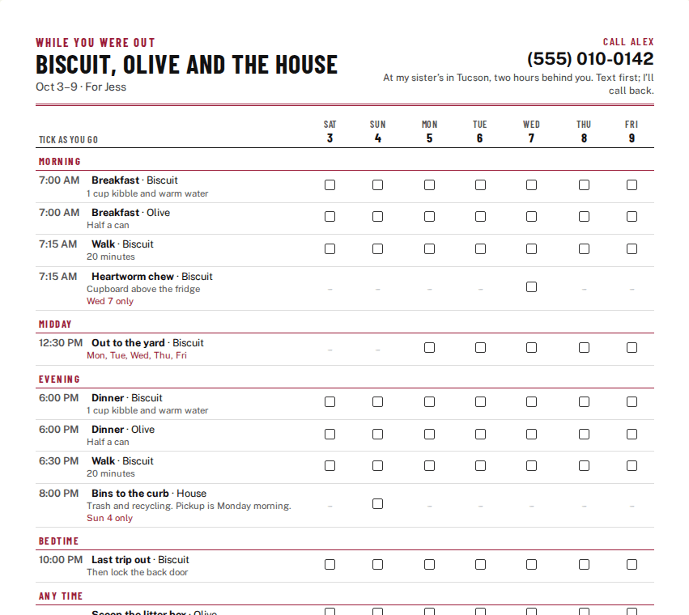

# While You Were Out

**Use it: [junkdrawer.works/while-you-were-out](https://junkdrawer.works/while-you-were-out/)**

**A care sheet for whoever's minding things while you're away, and notes back from them.** Write down what the dog sitter, house sitter or babysitter needs to know: feeding, meds, walks, the vet, the Wi-Fi, where the water shut-off is and who to call. Send it as a link or print it for the fridge. The sitter gets a checklist for each day of the stay, ticks jobs off as they go, and sends you a note back on a page from a pink While You Were Out pad.

<p align="center">
  
  &nbsp;
  
  &nbsp;
  
</p>

## How it works

- **Make the sheet.** The dates you're away, your phone and where you'll be, then everyone you're leaving: dogs, cats, other pets and children. Each has notes with suggested labels (Food, Meds, Walks, Don't, Bedtime, Allergies…). Notes labelled Meds, Allergies, Health or Don't are flagged for the sitter.
- **The words your dog knows.** Add the cue words and hand signals, or bring a dog in from [Trick Deck](https://junkdrawer.works/trick-deck/) with one tap. Both live on junkdrawer.works, so they share the browser's storage and the tricks your dog knows on cue come across by themselves.
- **The day.** Jobs in the morning, midday, evening, at bedtime or any time, with a time if it matters. A job can be every day, some weekdays (the mail on weekdays), or particular dates (the heartworm pill on the 5th, the bins on Sunday night). Tap a suggestion to add the usual ones for each animal or child.
- **The house and who to call.** The Wi-Fi, getting in, the thermostat, trash day, the water shut-off and the breaker panel. Door and alarm codes are blurred until tapped. Contacts get Call and Text buttons, and addresses link to directions. Poison-control lines (US) are added for pets and children, and 911 is at the top.
- **Send it.** The whole sheet goes in the link, squeezed with deflate, after the #, which browsers never send to a server. The sitter opens it and it's saved on their phone, where it works without signal. If you change something, send the link again. What they've ticked stays ticked, and an old link won't undo a newer one.
- **For the sitter**: Today, Care, House, Call and Notes. Today has a chip for each day of the stay and a big checkbox for each job, marked with the time it was done.
- **Notes back.** The sitter fills in a While You Were Out slip: All's well, Please call, Urgent, Running low, Package came, Sent photos, a message, and the day's ticked jobs with their times. It goes back as a link, or by text message to the number on the sheet. Open it and it's filed under that sheet.
- **Print it** for the fridge: page one is a grid with a box for every job on every day of the stay (or one column per weekday for a longer stay), then everyone's notes, the house, a Wi-Fi code a phone camera can scan, and who to call. You can leave the codes and the Wi-Fi password off the printout.
- No account and no server. Sheets, ticks and notes stay in the browser. Anyone with a link, or the piece of paper, can read what's on it, so send links only to the sitter. You can save a backup to a file and load it on another device. It works offline and installs to a phone's home screen.

<p align="center">
  
</p>

## Running it

It's a static site: plain HTML, CSS and JavaScript modules, with no build step.

```sh
npx serve .                   # or any static file server, then open the printed address
npm install                   # only for the tools below: esbuild and upng-js
npm test                      # dates, links and Trick Deck (Node 20+), then two phones in Chromium (needs Playwright)
node tools/screenshots.mjs    # redraws docs/*.png and og.png
node tools/make-icons.mjs     # redraws the PNG icons from icon.svg
node tools/trick-cues.mjs ../trick-deck   # refreshes js/cues.js from a Trick Deck checkout
npm run build                 # dist/while-you-were-out.html, the whole app in one file
```

To put it online with GitHub Pages: **Settings → Pages → Build and deployment → Deploy from a branch**, then pick `main` and `/ (root)`.

### Files

- `js/model.js`: the sheet and the note. It works out which jobs fall on which day, tidies up anything that arrives in a link or a backup, and makes the Wi-Fi code text. It has no page code, so the tests run it in Node.
- `js/share.js`: packs a sheet or a note into a link and back.
- `js/store.js`: saving in the browser (sheets, ticks and notes) and backups.
- `js/app.js`: which screen goes with which address, the home screen, and opening links that arrive.
- `js/edit.js`: making the sheet. `js/view.js`: the sheet as the sitter sees it. `js/slip.js`: the pink note, filling one in and reading one. `js/print.js`: the paper version. `js/send.js`: the send sheets.
- `js/ui.js`: pieces every screen uses. `js/example.js`: the example (Biscuit, Olive and the house).
- `js/trickdeck.js` and `js/cues.js`: reading dogs from Trick Deck, and each trick's cue word and hand signal.
- `js/qr.js` draws QR codes with `js/vendor/qrcode.js`, Kazuhiko Arase's QR Code Generator (MIT).
- `fonts/`: Barlow Condensed, Public Sans and Caveat, all under the SIL Open Font License, served from here so nothing loads from elsewhere.
- `sw.js`: keeps a copy for using offline.
- `test/unit.test.mjs` checks dates, which jobs fall on which day, links both ways, cleaning up what arrives, and the Trick Deck import. `test/e2e.mjs` makes a sheet on one phone (bringing a dog in from Trick Deck), opens it on a second, ticks jobs off, sends a note back, updates the sheet, prints it, and checks it works offline.
